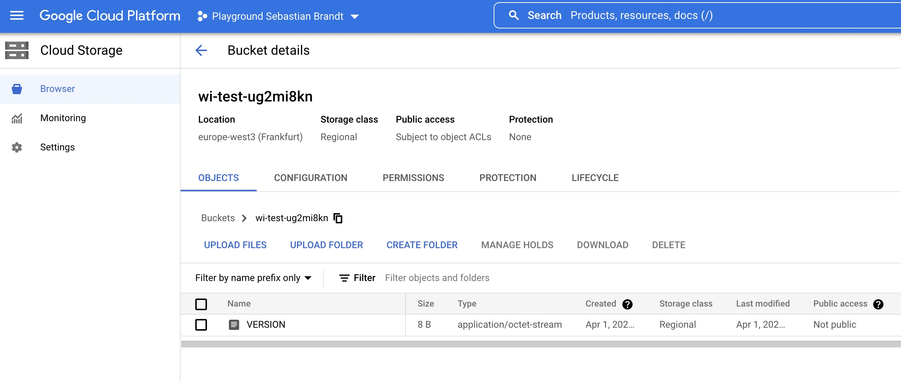

# GKE Workload Identity

Demo project to show GKE Workload Identity in action.

## Introduction

What if you are in the situation that your fancy new microservice wants to write
some data into a Google Cloud Storage Bucket.

Easy thing right?

- You are going to create a service account in your GCP project.
- Assign the objectCreator role
- Create a static private key which you are going to directly save in your kubernetes
cluster as secret.

Nasty ...

You can do better, with zero maintenance for static private key rotation.
Which I hope you did regularly in the past.

For this more secure solution we are going to use the GKE Workload Identity.
We don't have the need anymore to create a static private key. Instead we get
a short lived token which is going to be rotated per default every hour. Thanks
to that feature, we are able to fulfil the authentication chain of the Google API
implementation for many programming languages and frameworks.
Additionally the GKE Workload Identity can be strictly bound to
- a specific Kubernetes namespace, like `wi-test`
- and a specific Kubernetes ServiceAccount, like `wi-test`.

## Prerequisites

- [google-cloud-sdk]

Even though you can install `kubectl` in many other ways, this is the one for
GKE clusters which will also include the `gke-gcloud-auth-plugin`.

```bash
gcloud components install kubectl
```

## Action

For a basic start

```bash
PROJECT_ID=[YOUR_PROJECT_ID]
gcloud auth login
gcloud config set project ${PROJECT_ID}
gcloud auth application-default login
```

We are now authenticated against our Google Project and have set our
`application-default` credentials.

```bash
terraform init
terraform apply -var="project=${PROJECT_ID}" -var="region=europe-west3" -auto-approve
```

You should now have a successful Terraform run with an `Apply complete!` output like

```bash
Apply complete! Resources: 8 added, 0 changed, 0 destroyed.

Outputs:

bucket = "wi-test-ug2mi8kn"
cluster = "gke-wi-poc"
location = "europe-west3"
```

So for now provisioning your service we are
- pulling our created GKE cluster credentials
- creating a new namespace
- creating our Kubernetes ServiceAccount
- setting the GKE Workload Identity annotation, so that we can get the assigned GCP service account

In the last step we are manipulating for demonstration purpose in a oneline piped command
a manifest which gets applied to the GKE cluster and will copy a file to our provisioned
Google Cloud Storage Bucket.

```bash
gcloud container clusters get-credentials $(terraform output -raw cluster) --region=$(terraform output -raw location)
kubectl create namespace wi-test
kubectl --namespace wi-test create serviceaccount wi-test
kubectl --namespace wi-test annotate serviceaccount wi-test iam.gke.io/gcp-service-account=wi-test@${PROJECT_ID}.iam.gserviceaccount.com
kubectl -n wi-test run wi-test --image google/cloud-sdk:alpine --restart=Never --dry-run=server -o yaml -- "gsutil" "cp" "/google-cloud-sdk/VERSION" "gs://$(terraform output -raw bucket)" | sed -e "s/cpu: 500m/cpu: 250m/g" -e "s/memory: 2Gi/memory: 256Mi/g" -e "s/serviceAccountName: default/serviceAccountName: wi-test/g" | kubectl apply -f -
```

The output will look like

```bash
Fetching cluster endpoint and auth data.
kubeconfig entry generated for gke-wi-poc.
namespace/wi-test created
serviceaccount/wi-test created
serviceaccount/wi-test annotated
Warning: Autopilot set default resource requests for Pod wi-test/wi-test, as resource requests were not specified. See http://g.co/gke/autopilot-defaults.
Warning: Autopilot increased resource requests for Pod wi-test/wi-test to meet requirements. See http://g.co/gke/autopilot-resources.
pod/wi-test created
```

After some time the GKE auto pilot operated cluster will schedule the pod and
checking the pods logs

```bash
$ kubectl logs -f -n wi-test wi-test
Copying file:///google-cloud-sdk/VERSION [Content-Type=application/octet-stream]...
/ [1 files][    8.0 B/    8.0 B]
Operation completed over 1 objects/8.0 B.
```

You will see that the VERSION file got written in the bucket as new object,
as the serviceAccount was able to write into it.



```bash
terraform destroy -var="project=${PROJECT_ID}" -var="region=europe-west3" -auto-approve
```

[http]: https://registry.terraform.io/providers/hashicorp/http/latest/docs/data-sources/http
[container_cluster]: https://registry.terraform.io/providers/hashicorp/google/latest/docs/resources/container_cluster
[google-cloud-sdk]: https://formulae.brew.sh/cask/google-cloud-sdk#default
